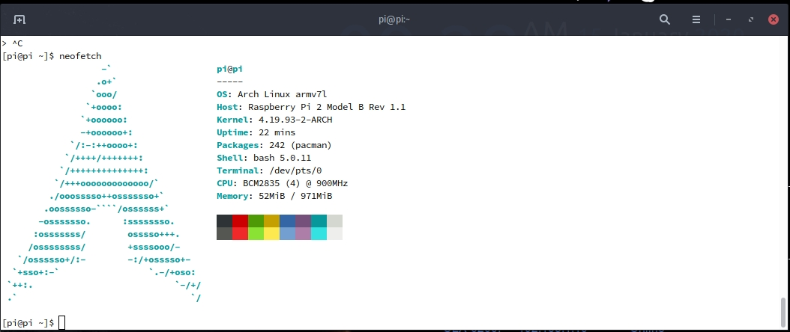

## ArchLinuxArm for your RPI

### 1. download the latest Arch Linux Arm image for your raspberrypi and flash it with the balena-etcher on your usb external hdd/ssd

### 2. mount the drive into your computer and add Label tags for Boot and Root partitions

boot partition: LABEL=ROOT into cmdline.txt `root=/dev/mmcblk0p2 -> root=/dev/sda2`, /boot/cmdline.txt:
```
root=/dev/sda2 rw rootwait rootdelay=30 console=tty1 selinux=0 plymouth.enable=0 smsc95xx.turbo_mode=N dwc_otg.lpm_enable=0 elevator=noop audit=0 ipv6.disable=1
```
boot partition: /boot/config.txt:
```
initramfs initramfs-linux.img followkernel
hdmi_drive=2
dtparam=audio=on
disable_overscan=1
dtoverlay=gpio-ir,gpio_pin=24
dtparam=i2c_arm=on

#enable vc4
gpu_mem=320
dtoverlay=vc4-fkms-v3d
max_framebuffers=2
dtparam=i2c_arm=on
```
root partition: LABEL=BOOT into /etc/fstab line `/dev/mmcblk0p1 -> /dev/sda1`, /etc/fstab:
```
# Static information about the filesystems.
# See fstab(5) for details.

# <file system> <dir> <type> <options> <dump> <pass>
/dev/sda1  /boot   vfat    defaults        0       0
```
***Dont Resize the ROOT partition it will be automaticaly resized in the first boot!!***

this way the system always searches the drive with labeled BOOT & ROOT partitions with out problem and boot even if you add multiple usb disks.

### 3. Put the SD Card into your pi, power it on and login with alarm/alarm
First of all get root:
```
sudo arp-scan -l
ssh alarm@ip_address -p 22
su
```
Password for root: `root`.

### 4. Set timezone & enable systemd-timesyncd Service
```
ln -sf /usr/share/zoneinfo/Europe/Athens /etc/localtime
systemctl enable systemd-timesyncd
systemctl start systemd-timesyncd
```
everytime RaspberryPi boots, given internet access, it will always sync hardware clock...

**5.A replace contents of `/etc/pacman.d/mirrorlist` with:**
```
sed -i 's/#Color/Color/' /etc/pacman.conf
sed -i 's/#TotalDownload/TotalDownload/' /etc/pacman.conf
## Geo-IP based mirror selection and load balancing
Server = http://gr.mirror.archlinuxarm.org/$arch/$repo
Server = http://de.mirror.archlinuxarm.org/$arch/$repo
Server = http://de2.mirror.archlinuxarm.org/$arch/$repo
Server = http://de3.mirror.archlinuxarm.org/$arch/$repo
Server = http://de4.mirror.archlinuxarm.org/$arch/$repo
Server = http://de5.mirror.archlinuxarm.org/$arch/$repo
Server = http://nl.mirror.archlinuxarm.org/$arch/$repo
Server = http://pt.mirror.archlinuxarm.org/$arch/$repo
Server = http://dk.mirror.archlinuxarm.org/$arch/$repo
Server = http://eu.mirror.archlinuxarm.org/$arch/$repo
Server = http://au.mirror.archlinuxarm.org/$arch/$repo
Server = http://br2.mirror.archlinuxarm.org/$arch/$repo
Server = http://hu.mirror.archlinuxarm.org/$arch/$repo
Server = http://sg.mirror.archlinuxarm.org/$arch/$repo
Server = http://za.mirror.archlinuxarm.org/$arch/$repo
Server = http://tw.mirror.archlinuxarm.org/$arch/$repo
Server = http://il.us.mirror.archlinuxarm.org/$arch/$repo
Server = http://ca.us.mirror.archlinuxarm.org/$arch/$repo
```

**5.B update the system**
```
pacman-key --init
pacman-key --populate archlinuxarm
pacman -Syu --noconfirm
```
**5.C install optional software**
```
pacman -S --needed nfs-utils htop openssh autofs alsa-utils alsa-firmware alsa-lib alsa-plugins git zsh wget base-devel diffutils libnewt dialog wpa_supplicant wireless_tools iw crda lshw sudo i2c-tools lm_sensors uboot-tools samba v4l-utils cronie x11vnc --noconfirm
```
**5.D install Mate-Desktop, Kodi**
```
pacman -S mate mate-extra xorg-server xf86-video-fbturbo-git xorg-xrefresh lightdm-gtk-greeter kodi-rbp4 --noconfirm
systemctl enable lightdm.service
#remove 'if (subject.user == "kodi")' from polkit rules file
sed -i '14d;2d' /usr/share/polkit-1/rules.d/10-kodi.rules
```
### 6. Users & Hostname pi
```
hostnamectl set-hostname pi
useradd -d /home/pi -m -G wheel -s /bin/bash pi
groupadd -r autologin
gpasswd -a pi autologin
sed -i 's/# %wheel ALL=(ALL) ALL/ %wheel ALL=(ALL) ALL/' /etc/sudoers
sed -i 's/#autologin-user=/autologin-user=pi/' /etc/lightdm/lightdm.conf
sed -i 's/#autologin-user-timeout=0/autologin-user-timeout=0/' /etc/lightdm/lightdm.conf
sed -i 's/#user-session=default/user-session=mate/' /etc/lightdm/lightdm.conf
passwd pi
```
reboot system and relogin
### 7. Aur Helper - Trizen || Yay(optional)
```
cd /tmp
git clone https://aur.archlinux.org/trizen.git
cd trizen
makepkg -si --noconfirm
```
```
cd /tmp
pacman -S --needed git base-devel
git clone https://aur.archlinux.org/yay.git
cd yay
makepkg -si --noconfirm
```
### 8. i2c interface
```
#enable i2c interface on kernel
echo 'dtparam=i2c_arm=on' >> /boot/config.txt
#enable modules on boot
echo 'i2c-dev' >> /etc/modules-load.d/i2c.conf
echo 'i2c-bcm2708' >> /etc/modules-load.d/i2c.conf
#give i2c interface non-root permissions
echo 'KERNEL=="i2c-[0-9]*", GROUP="wheel"' >> /etc/udev/rules.d/i2c.rules
```
### 9. Bashrc
```
#list
alias ls='ls --color=auto'
alias la='ls -a'
alias ll='ls -la'
alias l='ls' 					
alias l.="ls -A | egrep '^\.'"      

#fix obvious typo's
alias cd..='cd ..'
alias pdw="pwd"
alias pacu='trizen -Syu --noconfirm'

## Colorize the grep command output for ease of use (good for log files)##
alias grep='grep --color=auto'
alias egrep='egrep --color=auto'
alias fgrep='fgrep --color=auto'

#readable output
alias df='df -h'

#pacman unlock
alias unlock="sudo rm /var/lib/pacman/db.lck"

#free
alias free="free -mt"

#use all cores
alias uac="sh ~/.bin/main/000*"

#continue download
alias wget="wget -c"

#userlist
alias userlist="cut -d: -f1 /etc/passwd"

#merge new settings
alias merge="xrdb -merge ~/.Xresources"

# Aliases for software managment
# pacman or pm
alias pacman='sudo pacman --color auto'
alias update='sudo pacman -Syyu'

# yay as aur helper - updates everything
alias pksyua="yay -Syu --noconfirm"

#ps
alias ps="ps auxf"
alias psgrep="ps aux | grep -v grep | grep -i -e VSZ -e"

#grub update
alias update-grub="sudo grub-mkconfig -o /boot/grub/grub.cfg"

#improve png
alias fixpng="find . -type f -name "*.png" -exec convert {} -strip {} \;"

#add new fonts
alias fc='sudo fc-cache -fv'

#copy/paste all content of /etc/skel over to home folder - Beware
alias skel='cp -rf /etc/skel/* ~'
#backup contents of /etc/skel to hidden backup folder in home/user
alias bupskel='cp -Rf /etc/skel ~/.skel-backup-$(date +%Y.%m.%d-%H.%M.%S)'

#copy bashrc-latest over on bashrc - cb= copy bashrc
alias cb="cp ~/.bashrc-latest ~/.bashrc && source ~/.bashrc && sudo cp /etc/skel/.bashrc-latest /etc/skel/.bashrc"

#quickly kill conkies
alias kc='killall conky'

#hardware info --short
alias hw="hwinfo --short"

#skip integrity check
alias yayskip='yay -S --mflags --skipinteg'
alias trizenskip='trizen -S --skipinteg'

#check vulnerabilities microcode
alias microcode='grep . /sys/devices/system/cpu/vulnerabilities/*'

#mounting the folder Public for exchange between host and guest on virtualbox
alias vbm="sudo mount -t vboxsf -o rw,uid=1000,gid=1000 Public /home/$USER/Public"

#shopt
shopt -s autocd # change to named directory
shopt -s cdspell # autocorrects cd misspellings
shopt -s cmdhist # save multi-line commands in history as single line
shopt -s dotglob
shopt -s histappend # do not overwrite history
shopt -s expand_aliases # expand aliases

#Recent Installed Packages
alias rip="expac --timefmt='%Y-%m-%d %T' '%l\t%n %v' | sort | tail -100"

#Cleanup orphaned packages
alias cleanup='sudo pacman -Rns $(pacman -Qtdq)'

#get the error messages from journalctl
alias jctl="journalctl -p 3 -xb"

#create a file called .bashrc-personal and put all your personal aliases
#in there. They will not be overwritten by skel.

[[ -f ~/.bashrc-personal ]] && . ~/.bashrc-personal

neofetch

```
finally if you install neofetch:

